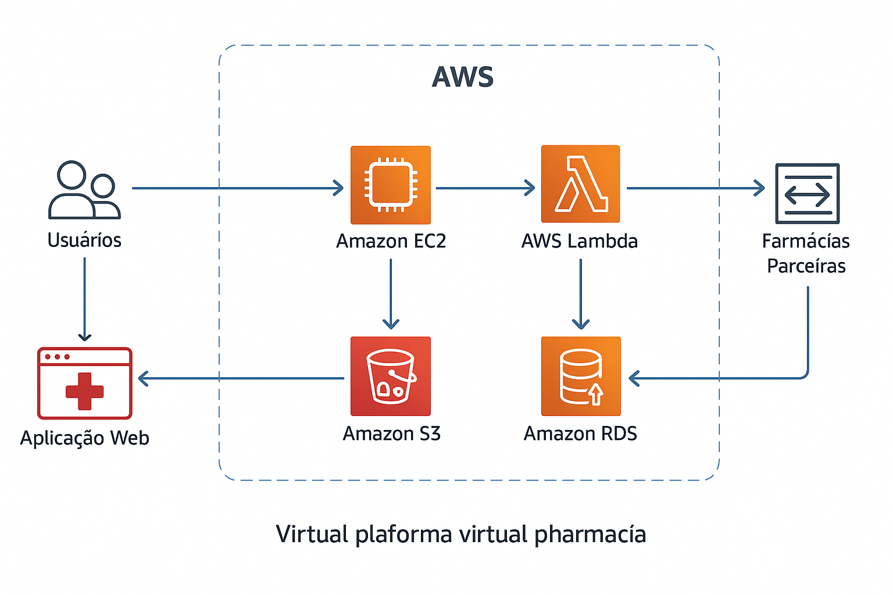

# RELATÓRIO DE IMPLEMENTAÇÃO DE SERVIÇOS AWS
Data: 19/06/2025 
Empresa: Abstergo Industries 
Responsável: João Afonso Fukiau 

## Introdução

Este relatório apresenta o processo de implementação de ferramentas na empresa Abstergo Industries, realizado por João Afonso Fukiau. O objetivo do projeto foi elencar três serviços 
da AWS com foco em redução de custos imediatos e ganho de eficiência, dentro do cenário de 
uma empresa farmacêutica que atua como distribuidora para outras farmácias e revendedoras.

## Descrição do Projeto

O Projeto foi dividido em três etapas, com foco na adoção de serviços gerenciados e escaláveis da AWS que eliminem a necessidade de investimentos pesados em infraestrutura física.

## Etapa 1:

- NOME DA FERRAMENTA: Amazon EC2 com Auto Scaling e Instâncias Spot.
- FOCO DA FERRAMENTA: Servidores virtuais escaláveis e econômicos.
- DESCRIÇÃO DE CASO DE USO: Para hospedar a aplicação da farmácia (ERP, APIs de 
estoque, dashboardas de parceiros), utilizamos o EC2 com Auto Scaling para ajustar 
dinamicamente a capacidade conforme a demanda. Usamos Instâncias Spot, que 
oferecem até 90% de desconto em relação ao preço sob demanda, reduzindo 
drasticamente os custos operacionais com servidores.

## Etapa 2:

- NOME DA FERRAMENTA: Amazon S3 (Simple Storage Service)
- FOCO DA FERRAMENTA: Armazenamento durável e de baixo custo.
- DESCRIÇÃO DE CASO DE USO: Substituímos servidores físicos de arquivos por buckets no 
Amazon S3, com versionamento fiscais, imagens de produtos e históricos de transações 
agora são armazenados de forma segura, com alta durabilidade (99,9%) e custo muito 
inferior ao armazenamento tradicional em datacenter.

## Etapa 3:

- NOME DA FERRAMENTA: AWS Lambda.
- FOCO DA FERRAMENTA: Execução de código sem provisionamento de servidores 
(Serverless).
- DESCRIÇÃO DE CASO DE USO: Automatizamos tarefas como envio de alteras de estoque 
baixo, geração de relatórios financeiros e integração com farmácias parceiras usando 
funções Lambda, que são acionadas sob demanda. Como não há custo em momentos 
ociosos, o uso do Lambda elimina desperdício de recursos, e o tempo de 
desenvolvimento e manutenção é reduzido.

## Conclusão

A implementação dos serviços da AWS na empresa Abstergo Industries proporcionará 
os seguintes benefícios:
- Redução de custos com servidores e armazenamento em até 60%, ao substituir 
infraestrutura tradicional por soluções em nuvem escaláveis;
- Automação de processos repetitivos, reduzindo o tempo e o custo operacional;
- Alta disponibilidade e escalabilidade, com resposta eficiente às variações de demanda;
- Segurança e confiabilidade, com backups automáticos e proteção de dados.

Recomenda-se a continuidade do uso dos serviços implementados e avaliação contínua 
de outras soluções AWS, como RDS, CloudWatch e AWS Backup, para ampliar os 
ganhos.

## Anexos

Arquitetura

